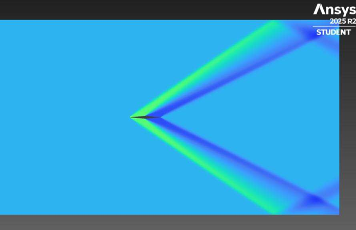

<h1 align="center">Hypersonic Airfoil CFD Investigation</h1>

Comparative CFD analysis of hypersonic airfoil configurations using ANSYS Fluent

Mach 1–6 • Shockwave Analysis • Aerodynamic Optimisation • Mesh Validation

---

## Overview

This project investigates the aerodynamic performance of multiple hypersonic airfoil geometries under compressible flow conditions using ANSYS Fluent.

The investigation compares:
- Double-Wedge Airfoil
- Bi-Convex Airfoil
- Dome Airfoil

across Mach 1 to Mach 6 flow regimes.

The study focuses on:
- shockwave behaviour
- pressure distribution
- drag characteristics
- solver convergence
- aerodynamic optimisation
- CFD validation methodologies

---

## Technical Details

### Software Used
- ANSYS Fluent
- SolidWorks
- MATLAB

### CFD Methodology
- Density-based solver
- Compressible flow modelling
- Structured mesh generation
- Mesh independence study
- Convergence validation

### Key Engineering Areas
- Hypersonic Aerodynamics
- Shockwave Analysis
- Pressure Distribution
- Drag Optimisation
- Solver Stability Investigation

---

## Simulation Results

### Mesh Validation
Upload mesh image here later.

### Mach Contour - Mach 6

### Pressure Distribution
Upload pressure contour here later.

### Solver Convergence
Upload convergence graph here later.

---

## Appendix

Detailed CFD results, contour plots, convergence studies, and validation outputs are included in the appendix report.

[View Appendix Report](Appendix.pdf)

---

## Author

Varun Saini  
Aerospace Engineering Graduate  
Preston, United Kingdom
